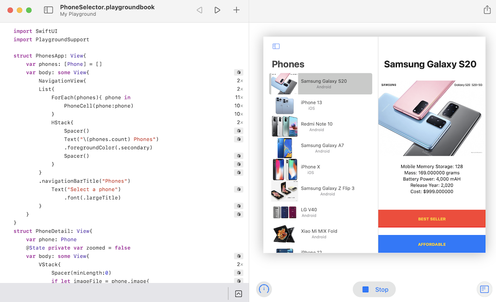

# PhoneSelector
Documentation of My Project from App Development Iterative Design

## Background

This program was written in the App Development course at SSIS in 2021-2022 in Swift. In the Playground simulation it looks like this:

## Conversion to xcode

With some modification the program was exported to xcode in order to compile it as a native iOS app for iPhone and iPad. The respective code is to be found in the xcode folder.
